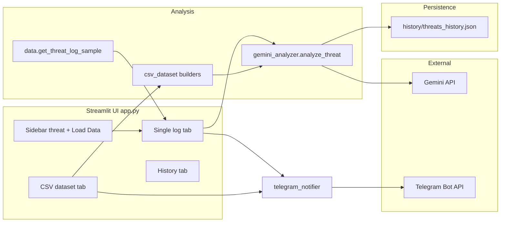

# Cyber Threat Detector — Technical Documentation

This document describes the **Cyber Threat Detector** Streamlit application: architecture, configuration, user flows, Python modules, data formats, persistence, and operational considerations.

---

## Table of contents

1. [Overview](#1-overview)
2. [Features](#2-features)
3. [Architecture](#3-architecture)
4. [Project layout](#4-project-layout)
5. [Installation](#5-installation)
6. [Configuration and secrets](#6-configuration-and-secrets)
7. [Running the application](#7-running-the-application)
8. [User guide](#8-user-guide)
9. [Session state reference](#9-session-state-reference)
10. [Module reference](#10-module-reference)
11. [Analysis pipeline](#11-analysis-pipeline)
12. [History file format](#12-history-file-format)
13. [CSV datasets](#13-csv-datasets)
14. [Bundled example data](#14-bundled-example-data)
15. [Dependencies](#15-dependencies)
16. [Troubleshooting](#16-troubleshooting)
17. [Security and compliance](#17-security-and-compliance)

---

## 1. Overview

**Cyber Threat Detector** is a web UI (Streamlit) that:

- Accepts **free-text security logs** or descriptions and analyzes them with **Google Gemini** (`gemini-2.5-flash`).
- Optionally loads **synthetic threat samples** (50 variants per attack family) for quick demos.
- Accepts **CSV security log exports**, builds **aggregated context** for a single holistic AI run, or runs **row-by-row** analysis for the first *N* rows.
- Persists each analysis (when enabled) to a local **JSON history** file.
- Sends **Telegram** notifications for threat vs. no-threat outcomes after successful analyses triggered from the UI.

The app uses a dark, GitHub-inspired theme via injected CSS.

---

## 2. Features

| Feature | Description |
|--------|-------------|
| **Threat categories** | Sidebar selector: Auto-Detect, Phishing, SQL Injection, DDoS Attack, Malware/Ransomware, Brute Force. Passed to the model as *Suspected Category*. |
| **Single log analysis** | Large text area + “Analyze with AI” → structured result + optional Telegram. |
| **Quick-load samples** | “Load Data” fills the text area from `data.py` (random among 50 strings per type; Auto-Detect picks a random category). |
| **CSV dataset tab** | Upload CSV, load bundled `security_logs_200_points.csv`, metrics, preview, full-dataset AI, optional row-by-row AI. |
| **History tab** | Table of past runs from `history/threats_history.json`; clear history. |
| **Severity styling** | Critical / High / Medium / Low badges with distinct colors. |

---

## 3. Architecture

High-level data flow:



- **`app.py`** orchestrates UI, session state, calls `analyze_threat`, and calls Telegram helpers after analysis.
- **`gemini_analyzer.py`** owns the Gemini client, prompt, JSON parsing, normalization, `is_threat` heuristics, and history writes.
- **`data.py`** provides synthetic log corpora (no network).
- **`csv_dataset.py`** parses CSVs and builds text for the model.
- **`telegram_notifier.py`** posts formatted messages via HTTP.

---

## 4. Project layout

Typical files next to `app.py`:

| Path | Role |
|------|------|
| `app.py` | Streamlit entrypoint, layout, tabs, Telegram orchestration. |
| `gemini_analyzer.py` | Gemini `generate_content`, result normalization, history append. |
| `data.py` | 50×5 synthetic log strings + `get_threat_log_sample`. |
| `csv_dataset.py` | CSV I/O, flagged-row logic, `build_dataset_summary_for_ai`. |
| `telegram_notifier.py` | `send_threat_alert`, `send_no_threat_message`. |
| `requirements.txt` | Python dependencies. |
| `history/threats_history.json` | Created at runtime; list of analysis records. |
| `security_logs_200_points.csv` | Optional bundled example for the CSV tab. |

**Note:** The Python module is named `data.py`. The directory **`history/`** stores JSON history so it does not shadow the `data` import (a folder named `data/` would conflict with `import data`).

---

## 5. Installation

1. **Python** 3.10+ recommended (matches Streamlit / `pandas` / `google-genai` expectations).

2. **Create a virtual environment** (recommended):

   ```bash
   python -m venv .venv
   .venv\Scripts\activate
   ```

3. **Install dependencies** from the folder that contains `requirements.txt`:

   ```bash
   pip install -r requirements.txt
   ```

4. **Configure API keys** (see [Section 6](#6-configuration-and-secrets)).

---

## 6. Configuration and secrets

### 6.1 Google Gemini

- **File:** `gemini_analyzer.py`
- **Variable:** `GEMINI_API_KEY` — passed to `genai.Client(api_key=...)`.
- **Model:** `gemini-2.5-flash` (string in `generate_content` call).

**Recommendation:** Move the key to an environment variable (e.g. `GEMINI_API_KEY`) and read it in code; avoid committing real keys to version control.

### 6.2 Telegram

- **File:** `telegram_notifier.py`
- **Variables:** `TELEGRAM_BOT_TOKEN`, `TELEGRAM_CHAT_ID`
- **Endpoint:** `https://api.telegram.org/bot<token>/sendMessage`
- **Options:** `parse_mode: "Markdown"`, `timeout=10` seconds.

**Recommendation:** Same as Gemini — use environment variables and restrict bot permissions to only what you need.

### 6.3 Local paths

| Constant | Meaning |
|----------|---------|
| `BASE_DIR` | Directory containing `app.py` (resolved from `__file__`). |
| `DATA_DIR` / `HISTORY_JSON` (`app.py`) | `BASE_DIR / "history"`, file `threats_history.json`. |
| `DATA_DIR` / `HISTORY_PATH` (`gemini_analyzer.py`) | Must match: `BASE_DIR / "history" / "threats_history.json"`. |

`gemini_analyzer` performs the append when `save_history=True`. The History tab reads the same path via `app.load_history_raw()`.

---

## 7. Running the application

From the directory that contains `app.py`:

```bash
streamlit run app.py
```

Streamlit prints a local URL (default **http://localhost:8501**). Use **wide** layout and an **expanded** sidebar (set in `st.set_page_config`).

---

## 8. User guide

### 8.1 Sidebar

- **Select Threat Type** — Maps to `THREAT_OPTIONS` in `app.py`. This value is sent to Gemini as *Suspected Category* for every analysis path (single log, CSV full dataset, CSV row-by-row).
- **Load Data** — Sets `st.session_state.threat_text_area` to a random synthetic log from `data.get_threat_log_sample(threat_choice)`, clears `analysis_result`, and reruns. Does **not** affect the CSV tab state directly.

### 8.2 Tab: Analyze Threat → Single log

1. Paste text into the log area (or use **Load Data**).
2. Click **Analyze with AI**.
3. On success: `notify_analysis_telegram(result)` runs (threat alert vs. no-threat message).
4. The detailed card uses `render_result`: threat name, severity badge, confidence, narrative sections, prevention, tools, immediate actions.

Empty input shows a warning and skips the API.

### 8.3 Tab: Analyze Threat → CSV dataset

1. **Upload** a `.csv` via the file uploader, or **Load example CSV** (`security_logs_200_points.csv` in `BASE_DIR`), or **Clear CSV** to reset.
2. **Fingerprint:** Uploads are keyed by `name|size` so reruns do not wipe CSV analysis results unless the file changes.
3. **Metrics:** Row count, column count, flagged count (if a `flagged` column exists).
4. **Event type breakdown** — Expander with JSON counts when `event_type` exists.
5. **Full-dataset AI summary** — Builds one long text block (`build_dataset_summary_for_ai`), one `analyze_threat` call with `save_history=True`, Telegram same as single log.
6. **Row-by-row AI** — Slider from **0** to **min(40, row count)**; analyzes `df.head(N)` only. Each row → `row_to_security_log_text` → `analyze_threat(..., save_history=False)`. **No Telegram per row.** Results table: `row`, `threat_name`, `category`, `severity`, `confidence`, `is_threat`.

### 8.4 Tab: History

- Reads `history/threats_history.json`.
- Displays columns: Time (UTC), Threat, Category, Severity, Confidence.
- **Clear History** overwrites the file with `[]`.

Entries created by row-by-row mode with `save_history=False` do **not** appear here unless you change that behavior.

---

## 9. Session state reference

| Key | Purpose |
|-----|---------|
| `analysis_result` | Last single-log Gemini result (`dict`). |
| `history_refresh` | Incremented when analyses complete (hook for future extensions). |
| `threat_text_area` | Bound to the single-log `st.text_area` via `key=`. |
| `csv_df` | Loaded `pandas.DataFrame` for CSV workflow. |
| `csv_dataset_ai_result` | Last full-dataset holistic result. |
| `csv_row_results` | `list[dict]` for row-by-row summary table. |
| `csv_upload_fingerprint` | `f"{filename}|{size}"` or `__bundled_example__` to detect new uploads. |

---

## 10. Module reference

### 10.1 `app.py`

| Symbol | Description |
|--------|-------------|
| `THREAT_OPTIONS` | Ordered list of sidebar labels. |
| `CUSTOM_CSS` | Injected `<style>` for dark theme and components. |
| `init_session()` | Initializes missing `st.session_state` keys. |
| `notify_analysis_telegram(result)` | Branches on `is_threat`; calls Telegram helpers with spinners/messages. |
| `load_history_raw()` | Returns `list` from JSON or `[]`. |
| `clear_history_file()` | Writes empty array to `HISTORY_JSON`. |
| `severity_class(sev)` | CSS class name for severity pill. |
| `render_result(res)` | Renders normalized Gemini dict as HTML sections. |
| `main()` | Page config, sidebar, tabs, all user flows. |

### 10.2 `gemini_analyzer.py`

| Symbol | Description |
|--------|-------------|
| `analyze_threat(input_text, threat_category, *, save_history=True)` | Builds expert prompt, calls Gemini, strips code fences, parses JSON (with regex fallback), normalizes, sets `is_threat`, optionally appends history. **Returns** normalized `dict` including `is_threat`. |
| `_normalize_result(obj)` | Coerces severity to allowed set, clamps confidence 0–100, ensures list lengths for steps/tools/actions. |
| `_save_history_entry(entry)` | Appends `{ saved_at, threat_category_selected, input_preview, result }`. |
| `is_threat` heuristic | `False` if threat name contains keywords like `no threat`, `clean`, `safe`, etc., or `confidence < 20`. |

**History preview:** First **500** characters of `input_text` stored as `input_preview`.

### 10.3 `data.py`

| Symbol | Description |
|--------|-------------|
| `_COUNT` | `50` variants per family. |
| `PHISHING_LOGS`, `SQL_INJECTION_LOGS`, … | Lists of strings. |
| `THREAT_LOG_LISTS` | Map from sidebar label (except Auto-Detect) to list. |
| `get_threat_log_sample(threat_choice)` | Auto-Detect → random category then random line; else random line for chosen type (fallback Phishing). |

### 10.4 `csv_dataset.py`

| Function | Signature / behavior |
|----------|----------------------|
| `read_csv_bytes(raw: bytes)` | `pd.read_csv(io.BytesIO(raw))`. |
| `read_csv_path(path: Path)` | `pd.read_csv(path)`. |
| `_flagged_mask(df)` | Boolean series: true for `True` or string in `true,1,yes` (case-insensitive). |
| `row_to_security_log_text(row, max_len=600)` | `col=value` joined by ` \| `; truncates with `...`. |
| `build_dataset_summary_for_ai(df, sample_limit=40)` | Multi-section text: counts, top IPs, sample rows (flagged first). |
| `validate_log_dataframe(df)` | `(ok: bool, error_message: str)`. |
| `summarize_df_quick(df)` | Dict with `rows`, `columns`, optional `event_type_counts`, `flagged_count`. |

### 10.5 `telegram_notifier.py`

| Function | Returns | Notes |
|----------|---------|--------|
| `send_threat_alert(threat_result: dict)` | `(bool, str)` | Markdown body with severity emoji, actions list. |
| `send_no_threat_message()` | `bool` | Success if HTTP 200. |

---

## 11. Analysis pipeline

1. **Input** — Raw string (pasted log, synthetic sample, or CSV-derived text).
2. **Prompt** — Static template instructing JSON-only output and listing required keys.
3. **Model response** — Strip markdown fences; `json.loads` or extract first `{...}` via regex.
4. **Normalization** — `_normalize_result`.
5. **Threat flag** — Keyword + confidence heuristic → `is_threat`.
6. **Persistence** — If `save_history`, append to `history/threats_history.json`.
7. **UI** — `render_result` / dataframe; **Telegram** from `app.notify_analysis_telegram` for single-log and CSV full-dataset flows.

---

## 12. History file format

**Path:** `history/threats_history.json`  
**Shape:** JSON array of objects.

Each object typically includes:

| Field | Type | Description |
|-------|------|-------------|
| `saved_at` | string (ISO-8601, UTC) | Set inside `_save_history_entry`. |
| `threat_category_selected` | string | Sidebar value at analysis time. |
| `input_preview` | string | Truncated input (500 chars from analyzer). |
| `result` | object | Normalized model output (`threat_name`, `threat_category`, `severity`, `confidence`, lists, `is_threat`). |

The History tab maps `result` into a flat table for readability.

---

## 13. CSV datasets

### 13.1 Designed-for schema (example file)

The bundled `security_logs_200_points.csv` includes columns such as:

`timestamp`, `event_type`, `severity`, `source_ip`, `username`, `password_attempted`, `path`, `method`, `user_agent`, `attempt_number`, `status_code`, `message`, `bytes_sent`, `response_time_ms`, `country`, `flagged`

**Enhancements when columns exist:**

- `event_type` — value counts in AI context and UI expander.
- `severity` — distribution in AI context (log-line severity, not the same as model output severity).
- `flagged` — count + prioritized sampling for the holistic prompt.
- `source_ip` — top 15 IPs by frequency in AI context.

### 13.2 Arbitrary CSVs

Any CSV with at least one column and one row passes `validate_log_dataframe`. Rows are still rendered as `col=value` pairs for row-by-row mode and for sample lines in the holistic summary.

### 13.3 Cost and latency

- **Full dataset:** One Gemini request; context size grows with `sample_limit` and row width (default `sample_limit=40`, row cap ~600 chars in samples).
- **Row-by-row:** One request **per row** selected (max 40). Suitable for small *N* only; no history/Telegram per row by design.

---

## 14. Bundled example data

- **`security_logs_200_points.csv`** — Mixed normal and suspicious-style rows (e.g. failed logins, flagged events). Used by **Load example CSV**.
- **`data.py`** — 250 synthetic multi-line log texts (50 × 5 categories) for demos without uploading files.

---

## 15. Dependencies

From `requirements.txt`:

| Package | Minimum (declared) | Usage |
|---------|-------------------|--------|
| `streamlit` | 1.31.0 | Web UI |
| `google-genai` | 0.5.0 | Gemini client |
| `plotly` | 5.18.0 | Declared; not required by core paths documented here (optional future charts) |
| `pandas` | 2.1.0 | CSV + history table |
| `requests` | 2.31.0 | Telegram HTTP |

---

## 16. Troubleshooting

| Symptom | Likely cause | What to check |
|---------|----------------|----------------|
| `Analysis failed` / JSON error | Model returned non-JSON or malformed text. | Retry; inspect raw response in debug; tighten prompt if customizing. |
| History empty after row scan | `save_history=False` for those calls. | Expected; use full-dataset analysis to log once. |
| Telegram errors | Invalid token/chat ID, network, Markdown parsing on special characters in model text. | Test with BotFather; escape Markdown or switch to HTML mode in code if needed. |
| Import error for `data` | A folder named `data` next to `app.py` can shadow `data.py`. | Use `history/` for JSON (as in current layout), not a conflicting `data/` package. |
| CSV parse error | Wrong encoding or non-CSV file. | Save as UTF-8 CSV; use correct extension. |

---

## 17. Security and compliance

1. **Secrets:** Rotate any API keys or tokens that were ever committed to a repo; load secrets from the environment or a secret manager.
2. **Data handling:** Logs may contain PII (IPs, usernames). History stores `input_preview` snippets — treat `history/` as sensitive.
3. **Third parties:** Sending log excerpts to Gemini and Telegram implies data leaves your machine — ensure policy compliance before pasting production logs.
4. **Telegram Markdown:** User-controlled or model-generated text in messages can break Markdown or cause formatting issues; consider sanitization or `parse_mode` changes.

---

## Document revision

- **Application:** Cyber Threat Detector (Streamlit).
- **Doc scope:** Repository layout under `app.py`’s directory as described in sections 4–15.

For changes to behavior, prefer updating this file when you add features (new tabs, new env vars, new CSV columns, model name changes).
